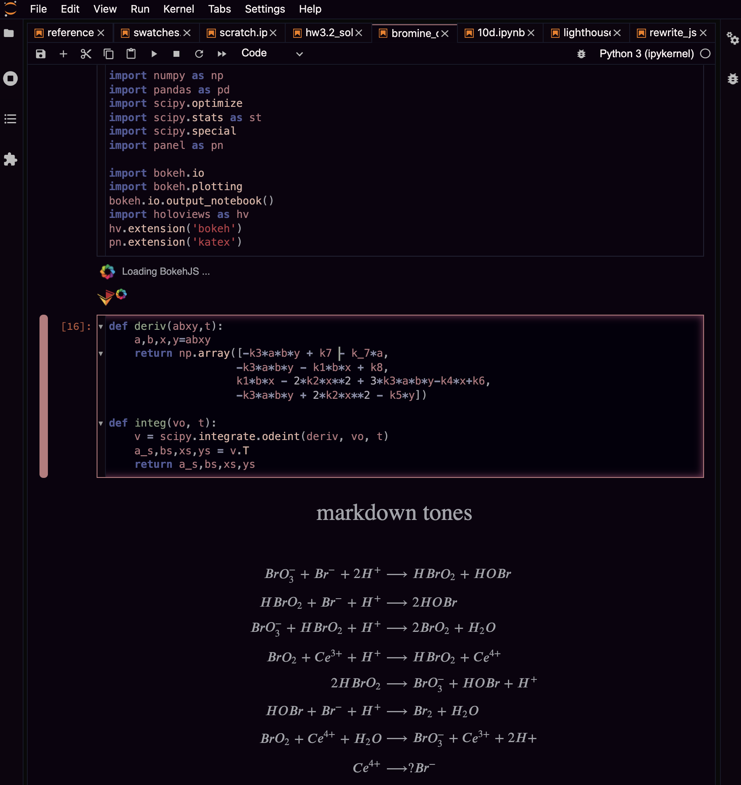

# 
jupyter-lab-themes

- the original dark theme is a bit too jarring for me, but I don't know how to actually create a new theme, so I've just changed the colors in the "JupyterLab Dark" theme's index.css file manually  
- storage for light theme (modified layout and accent colors), jupyter build deleted previous copy! 
- for me, the `index.css` file was in `/anaconda3/share/jupyter/lab/themes/@jupyterlab/theme-dark-extension/index.css` (note that the @ sign should have a forward slash before it `\` if typing directly into terminal)

- current colors are a blend of VSCode's Rouge2 theme and personal preference

##Dark theme: 

##Light theme: 

- to use, I would recommend copying the entire block of code from the dark [`index.css`](https://github.com/atisor73/jupyter-lab-themes/blob/master/theme-dark-extension/index.css) or light [`index.css`](https://github.com/atisor73/jupyter-lab-themes/blob/master/theme-light-extension/index.css) file above and pasting it under your own index.css file, and comment out what's originally there, in case anything breaks, or if you like totally hate it

- after saving the file, there's no need to rebuild jupyter lab (in fact, this would just overwrite all your changes and re-download the original *.css files), just refreshing localhost:xxxx worked for me (and changing: Settings &rarr; JupyterLabTheme &rarr; JupyterLab Dark)

- to make any further modifications, very little html knowledge is needed; the structure of rgb and hex formatting is fairly straightforward (although some of the variable names are a bit ambiguous)

- bulk of changes of were made under the following sections:
    - / * Code mirror specific styles * /
    - / * Cell specific styles * /
    - / * Layout * /
    - / * Borders * /

- I used the default Digital Color Meter app on macOS to extract desired values from pixels on my screen, but there are plenty of other palette-selecting software / websites out there 

